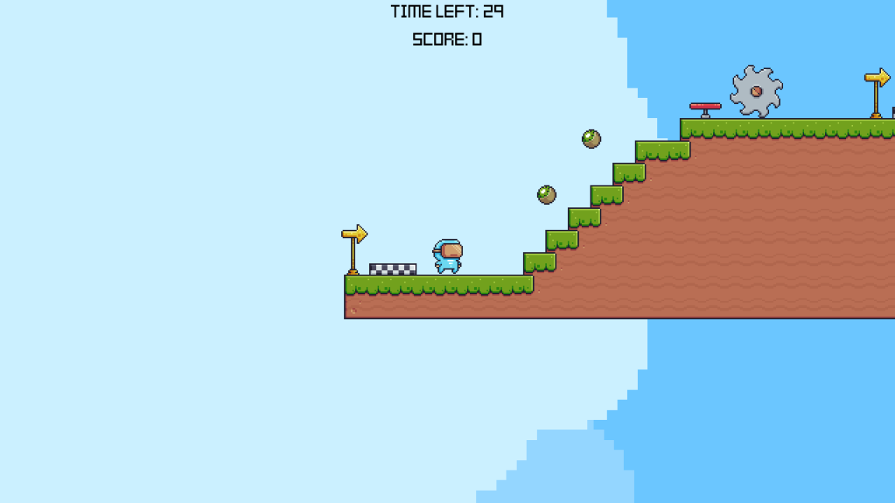

# VHS Platformer

A retro-styled 2D platformer prototype built with **Godot 4.6**. Jump across floating platforms, collect fruit, activate checkpoints, dodge hazards, and reach the exit before the level timer resets you.

## Features

- Two connected platforming levels
- Double jump movement
- 30-second level timer
- Checkpoints, jump pads, saw hazards, and death zones
- Kiwi collectibles with a score HUD

## Controls

| Action | Input |
| --- | --- |
| Move | Left / Right Arrow |
| Jump / Double Jump | `Space` or `Enter` (`ui_accept`) |

## Run the project

1. Install **Godot 4.6** or newer.
2. Open `project.godot`.
3. Press `F5` to run the game.

## Project structure

- `scenes/` - Godot scenes for the player, levels, HUD, and interactable objects
- `scripts/` - Gameplay logic for movement, checkpoints, collectibles, exits, and UI
- `assets/` - Sprites, backgrounds, fonts, audio, and other art resources
